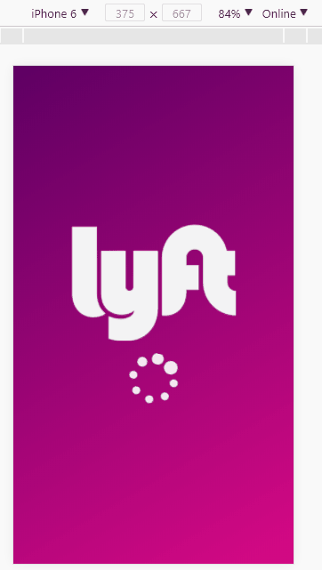
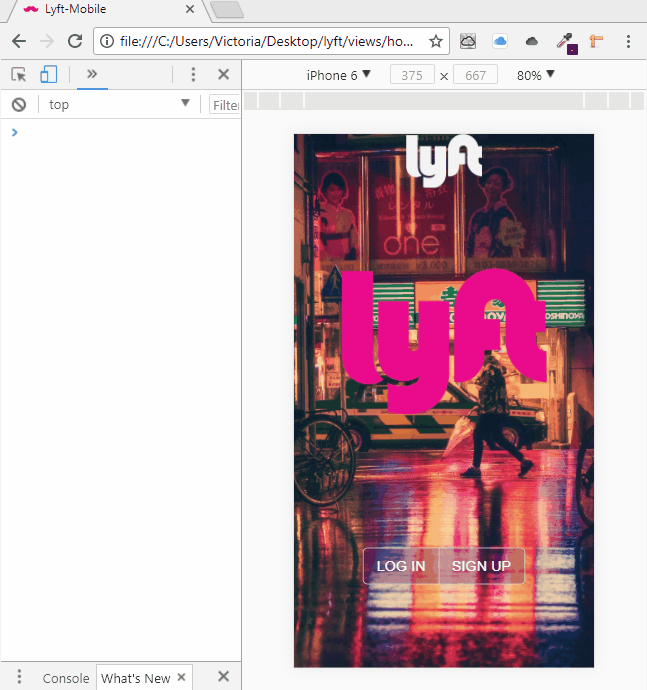

# L Y F T
## Sprint 3 Laboratoria | Unidad 3

###### FLUJO DE LA APLICACIÓN.
Vista splash con duración de 4 segundos que redirecciona a vista de inicio. La vista de inicio cuenta con dos botones, habilitando el flujo de "SING UP".

En la siguiente vista se muestra un formulario donde nuestro usuario puede elegir su país de origen, seguido de ingresar su número telefónico. El botón rosado "NEXT", sólo se habilita al haber ingresado un número de 10 dígitos.

Al dar click, el usuario recibe una alerta con un código generado aleatoriamente (LAB-000)_1_* y direccionar a la siguiente vista.

Posteriormente el usuario puede iniciar sesión "Sign-in" por medio de un formulario que le pide su nombre, apellido y correo electrónico. Se cuenta también con un checkbox para aprobar los términos y condiciones de Lyft.

Al finalizar y oprimir el botón "NEXT" se muestra una vista al usuario con la leyenda "You Rock!", un pulgar arriba y la opción de regresar a la vista principal "Home".

_1* Los digitos generados por el código aleatorio se imprimen en consola (dentro de una función que almacena el código generado). Se hace uso de la propiedad "localStorage" para ello. *_

## Resultado

